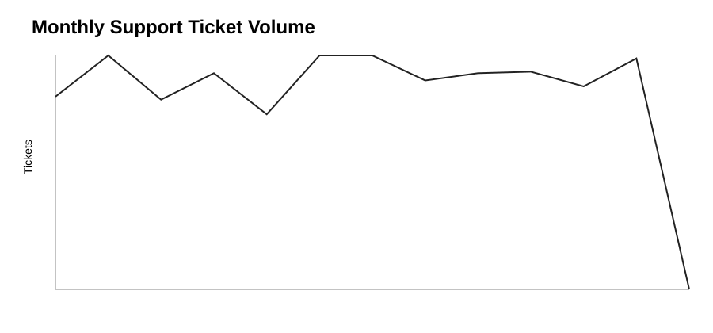
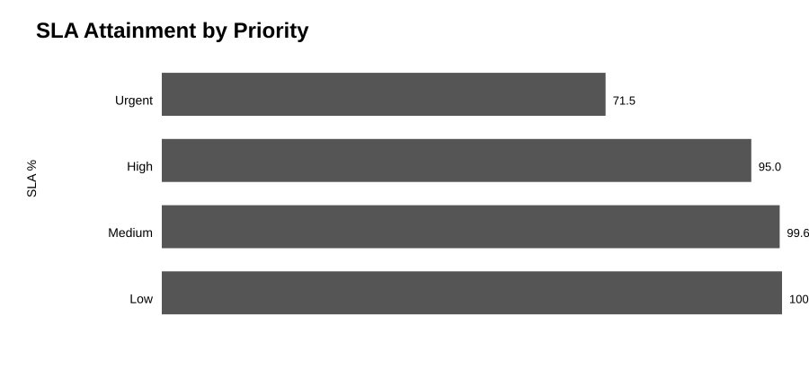
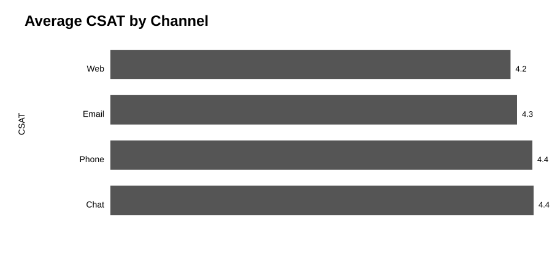
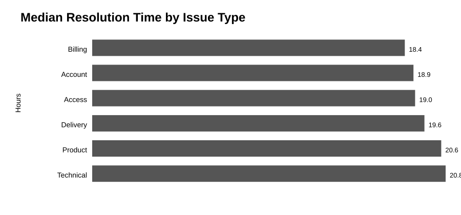

# Customer Support Intelligence

## Support operations → evidence → business decisions

A recruiter-ready **business and operations analytics** project that turns support-ticket data into measurable insights across demand, service levels, customer experience, operational complexity, backlog risk, and scenario-based business impact.

> **Recruiter takeaway:** this project demonstrates how I move from operational data to KPIs, segment the evidence, test plausible explanations, quantify scenarios, and translate findings into practical investigation priorities.

## Interactive Dashboard

Run the project locally:

```bash
pip install -r requirements.txt
streamlit run app.py
```

The dashboard supports filters for **channel, priority, issue type, and agent team**. It exposes executive health KPIs, operational risk signals, backlog aging, SLA/CSAT association, and an explicitly labeled escalation-cost scenario.

For a hosted version, deploy `app.py` on any Streamlit-compatible hosting service.

## The Business Problem

Support teams can look healthy on average while a smaller group of slow, high-priority, escalated, or reopened cases creates most of the operational pain. This project goes beyond headline averages by examining long-tail service performance, segment concentration, backlog aging, customer outcomes, and scenario-based operational impact.

### Questions the analysis answers

- Where is ticket demand concentrated by month, channel, priority, and issue type?
- Are service-level targets being met?
- Does P90 service time reveal a long tail hidden by averages?
- Where are escalations and reopenings concentrated?
- Which segments combine meaningful volume with service risk?
- Is lower CSAT associated with missed SLA in the observed data?
- How old are open/pending cases at the dataset observation date?
- What would a hypothetical reduction in escalations imply for workload and cost under explicit assumptions?

## Executive View

| Lens | Measures | Decision question |
|---|---|---|
| **Demand** | Ticket volume + trend | Where is workload concentrated? |
| **Responsiveness** | Avg / median / P90 first response | Are slow cases hidden by averages? |
| **Resolution** | Avg / median / P90 resolution | Where does case handling slow down? |
| **SLA** | Overall + priority attainment | Which service commitments are at risk? |
| **Customer** | CSAT + low-CSAT rate | Where is customer experience weakest? |
| **Complexity** | Escalation + reopen rate | Which cases create repeat workload? |
| **Backlog** | Open/pending aging buckets | Which unresolved cases are becoming risky? |
| **Business impact** | Scenario workload/cost | What could an intervention change under stated assumptions? |

## Decision Framework

The project separates four layers that are often mixed together in weak analytics work:

1. **Observation** — what the data shows.
2. **Association** — which variables move together or differ across groups.
3. **Scenario** — what could happen under explicit assumptions.
4. **Decision** — what should be investigated or tested next.

The dashboard deliberately avoids presenting synthetic associations as causal findings or scenario savings as actual financial results.

## Visual Analysis

The key charts are visible directly on GitHub:









These visuals are generated from the project's fixed-seed synthetic dataset and committed as SVG so a recruiter can inspect the analytical output without opening the source code.

**[Open the Executive Support Dashboard](reports/executive_dashboard.md)** for the KPI and operational decision framework.

## Analytical Workflow

```text
Synthetic Support Data
        ↓
Validation & Cleaning
        ↓
KPI Calculation → Mean / Median / P90
        ↓
SLA / CSAT Analysis → Segment Signals
        ↓
Backlog Aging → Operational Risk
        ↓
Scenario Impact → Explicit Assumptions
        ↓
SQL + Visual Reporting
        ↓
Investigation / Decision Framework
```

## What This Demonstrates

**KPI analysis** — volume, response time, resolution time, SLA, CSAT.

**Service analytics** — average, median, and P90 metrics to expose long-tail cases.

**Segmentation** — channel, priority, issue type, team, and month.

**Operational risk** — escalation, reopen, and backlog-aging analysis.

**Statistical discipline** — observed associations are distinguished from causal claims; minimum-volume thresholds reduce overinterpretation of tiny segments.

**Business scenarios** — hypothetical cost/workload impact is driven by user-supplied assumptions and clearly labeled as scenario analysis.

**Business communication** — `Observation → evidence → association → scenario → next investigation`.

## Tech Stack

**Python · pandas · NumPy · SQL · Matplotlib · Git/GitHub · GitHub Actions · pytest · Streamlit**

## Reproduce It

```bash
pip install -r requirements.txt
python src/generate_data.py
python src/clean_data.py
python src/support_analysis.py
python src/create_visualizations.py
pytest -q
```

## Repository Map

| Folder | Purpose |
|---|---|
| `app.py` | Interactive decision-oriented dashboard |
| `reports/` | Executive support interpretation |
| `visualizations/` | Recruiter-visible charts |
| `sql/` | Reusable operational queries |
| `src/` | Data generation, cleaning, analytics, and decision metrics |
| `tests/` | Automated validation |
| `.github/workflows/` | CI quality checks |

## Data Integrity & Limitations

The dataset is **synthetic** and exists solely for portfolio demonstration. It contains no private customer records, employer data, or production support information. Results demonstrate analytical methodology rather than real-company performance.

The synthetic generator intentionally creates service relationships such as priority/channel effects. Therefore, relationships observed in the generated data should be treated as **demonstrations of analytical technique**, not discoveries about real customer behavior.

Capacity and financial impact are not measured from real agent payroll or staffing records. Any cost/workload figures in the dashboard are scenario estimates based on user-entered assumptions.

## Portfolio

Part of a three-project analytics portfolio:

- **Macro Market Intelligence** — economic and market context
- **Trading Risk & Performance Analytics** — financial risk and performance
- **Customer Support Intelligence** — business and operations analytics
